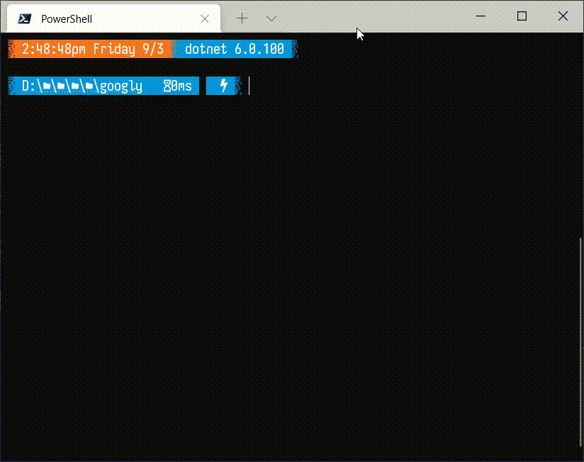
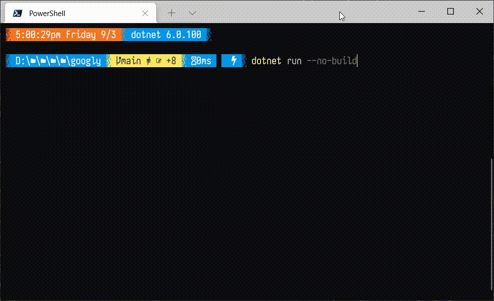

Googly eyes are fun.

The origin of this project is described in [this imgur album](https://imgur.com/a/oPeQgmw) - giving my 3D printer an amusing face using stick-on googly eyes.  But alas, the stick on googly eyes just aren't googly enough.  And i have a lot of time to kill.

There will be a few parts to this project:

    
CLI googlies

ASCII Art googly eyes because why not.  A quick and dirty way to visualize the animation and a sanity-check on the googly-math.  A C# version to start, with a likely Python version to follow.  I was hoping to pair Spectre's [Live Display](https://spectreconsole.net/live/live-display) with [Canvas Image](https://spectreconsole.net/widgets/canvas-image) but it appears they may not be compatible.  So for now it's a flickery console clear + full redraw per frame.  Next step is using Live Display with a vanilla Canvas, with proper bounding box / single pass pixel-level updates that the LCD version of the project will need.

Simulated constant random x-axis movement:

And an initial random "push" then letting gravity do its thing:

    
Blazor googlies

Using `Excubo.Blazor.Canvas` to start.  It will hog CPU and be on the back burner until i get the LCD bits done.

    
LCD googlies for 3D printer

The rest is for fun - this is the heart of the project.  Coupling either a [D1 Mini](https://www.wemos.cc/en/latest/d1/d1_mini.html) or [S2 Mini](https://www.wemos.cc/en/latest/s2/s2_mini.html) with a [2.4" LCD](https://www.wemos.cc/en/latest/d1_mini_shield/tft_2_4.html) and an accelerometer to feed x-axis jerk data to the software googlies.  And since it's keeping an eye on print head movement, it'll know when the print is done and do IoT things to let me know.
    
Initial version will be done in MicroPython - hopefully performance is OK.  If not, Arduino it is.  (D1/S2 Minis can run either!)  I'd like to take a stab at a [.net nano](https://docs.nanoframework.net/) version later on.  A quick google turns up no drivers for the LCD or accelerometer i'm using, so i'd have to port some over.  Also not *entirely* sure if the ["WROOM_32"](https://docs.nanoframework.net/content/esp32/esp32_firmware_versions.html#wroom_32) firmware is compatible with the S2 Mini's `ESP32-S2`.  (Still on the way from AliExpress !)

Ponderings:
* the LCD is touch-capable.  "follow my finger" needs to happen.
* the accelerometer has "double tap" recognition, this is likely what will be used to initiate "let me know when the print is done" mode.
* toss in a humidity sensor to track ambient humidity ?  
* ...

---

Credit to [adafruit](https://learn.adafruit.com/hallowing-googly-eye) for the googly-bouncing math/algorithm.