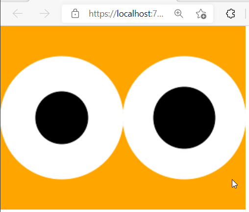

Googly eyes are fun.

The origin of this project is described in [this imgur album](https://imgur.com/a/oPeQgmw) - giving my 3D printer an amusing face using stick-on googly eyes.  But alas, the stick on googly eyes just aren't googly enough.  And i have a lot of time to kill.

There will be a few parts to this project:

    
Console googlies

 Because why not.  A quick and dirty way to visualize the animation and a sanity-check on the googly-math.  I was hoping to pair Spectre's [Live Display](https://spectreconsole.net/live/live-display) with [Canvas Image](https://spectreconsole.net/widgets/canvas-image) but it appears they're incompatible.  So for now it's a flickery console clear + full redraw.  No pixel-level work here, just using ImageSharp's `EllipsePolygon` to draw on Spectre's `CanvasImage` which has a `MaxWidth` set to squish pixels into ["coxels"](https://twitter.com/SimonCropp/status/1331554791726534657?s=20).

Simulated constant random x-axis accelerometer input:

And an initial random "push" then letting gravity do its thing:

    
Blazor googlies

Using `Excubo.Blazor.Canvas` to start.  Initially i'd hoped this would be a good place to get comfy with the pixel-level doodling but unfortunatley it's [not straightforward](https://github.com/excubo-ag/Blazor.Canvas/issues/147#issuecomment-801318839).  So for now the project is pretty much the same as the Console one, APIs to draw circles.

    
LCD googlies for 3D printer

This is the "real" project.  Coupling an [S2 Mini](https://www.wemos.cc/en/latest/s2/s2_mini.html) with a [2.4" LCD](https://www.wemos.cc/en/latest/d1_mini_shield/tft_2_4.html) and an accelerometer to feed x-axis movement data to the software googlies.  It'll be my first project to use CircuitPython.  (I've been enjoying the D1 Mini/MicroPython combo but as the D1 Mini is an ESP8266 there is no CircuitPython support.)

Ponderings:
* The LCD is touch-capable.  "Follow my finger" needs to happen.  That may be tricky/hacky as CircuitPython has no interrupt support.
* The accelerometer has "double tap" recognition, this will be used to enter "watch my print" mode, doing IoT things after the printer is deemed idle.
* Will tap into the printer's 24-volt [interface plate](https://www.fargo3dprinting.com/products/interface-plate-keypin-wanhao-duplicator-i3-plusmaker-select-plus/) thingy for power.
* ...
  
And since it's keeping an eye (hah!) on movement, it'll know when the print is done and do IoT things to let me know.  (Yes... i am aware octoprint is a thing.)  This is done on a D1 Mini and an 8*8 LED matrix - acting as a tiny clock until it gets `Idle=true` from the GooglyScreen, at which point it will switch to a bright indicating pattern.

---

Credit to [adafruit](https://learn.adafruit.com/hallowing-googly-eye) for the googly-bouncing math/algorithm.

I've implemented a simulated LIS3DH to make sure the acceleration numbers are in check with those that the Adafruit code would be dealing with, apart from the elaspsed times (48mhz vs 3.6ghz and all), and actual g-forces their device experiences when shaken.  

Remaining annoyances:

* The LIS3DH values are random and alternate between positive and negative. This can make the animations pretty ugly.  For the Console/Wasm versions, only poll for new acceleration values every *n* frames gives the googly keeps the animation smooth and less erratic.  The inputs for the hardware version may be vastly different though...

* Fine tuning G_SCALE in particular is fiddly.  When gravity otherwise "looks good", when the pupil settles it will continually "bounce" due to the gravitational constant.  Tweaking Elasticity helps some.  See the end bits of [wasm animation](googly_wasm_gravity.gif).

* The pupil still goes out of bounds sometimes, gotta figure out the math to cap it.  But maybe i'm doing something wrong elsewhere, eh.